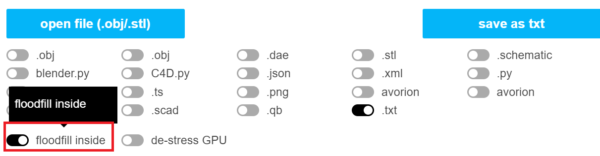

# Final Project: Bread

## Stephanie Goldberg - slgold
- Demo: https://slgold95.github.io/bread/
- You may need to zoom the camera out at first to fit the shapes in the screen. The Cherries are the largest.
- The GUI sliders have the range from 0 to 5, for some of the smaller shapes you'll have to continue to slide the slider up/down until you see it effecting the voxelization if it doesn't appear to be doing anything (it has to reach the shape).
- Inspired by: "Procedural Bread Making" by Rodrigo Baravalle, Gustavo Ariel Patow, and Claudio Delrieux https://www.sciencedirect.com/science/article/pii/S0097849315000503?via%3Dihub

-  

## References
- Lecture slides on Voxelizing a Mesh: https://docs.google.com/presentation/d/e/2PACX-1vSXYK_Ic2S46Z4rDcJPFIJDvrVURgYq5mcIcbWRJpZQDj7p4rKiy9I31qdqohnyXBQzD7giTZF_7Yga/pub?start=false&loop=false&delayms=60000&slide=id.p
- Resource for voxelizing .obj files: http://drububu.com/miscellaneous/voxelizer/?out=txt
- 2D Texture reading Github example: https://github.com/CIS-566-2019/textured-flame 
- TurboSquid.com for .obj files
    + Cherries: Cherries by browntimmy
    + Car: Duesen Bayern Mystar 190 SL by desmonster
    + Loaf: Dark durumbread by Luca Buono
- Binvox resource (initially used to generate a .raw file with voxelization data, but currently just using the chevalier.obj file): http://www.patrickmin.com/minecraft/?fbclid=IwAR3bLDlsaZU5ba9HTH4njX7CKWeJC9MufzTQLYtFO16e1O4xUZ1eoxsp70k
- Binvox help: https://web.archive.org/web/20131213132022/https://minecraft.gamepedia.com/Binvox

## Result Pictures:
- Cherries
- Uncooked:
-  
- Baked:
- 
- Sliced Through:
-  

- Knight
- Uncooked:
-  
- Baked:
- 
- Sliced Through:
- 

- Car
- Uncooked:
- 
- Baked: 
- 
- Sliced Through:
- 

- Loafs
- Uncooked:
-  
- Baked:
- 
- Sliced Through:
- 

## Misc. Features
- File loading
- 2D Texture Reading
- Lambertian Shading
- Creating a Mesh from a file read and loaded in
- Instance rendering for cubes to create the voxelization of the .obj file
- Can use the GUI sliders to obtain any arbitrary slice of the voxelization

## Voxelization
- From the voxelization resource, http://drububu.com/miscellaneous/voxelizer/?out=txt , saved the voxelization data as a .txt file.
- Took an .obj file (like wahoo below):
- 
- Voxelized the .obj file with the resource:
- 
- Saved the resulting voxelization data as a .txt file.
- Used two .txt files per .obj file loaded in
    + Toggled on and off the floodfill option to have one version with the inside of the mesh filled with voxels and one without (a hollow voxelization)
    +   
- Parsed the data from files - the .txt files have position data (see below)
- 
- Created arrays of voxel data (those x,y,z coords for positions), one for "inner" voxels and one for "outer" voxels
- Instance rendered cubes (as Meshes) with the voxel data
-  
-  

## Parsing .txt files
- Parsing the .txt files into a string, and then splitting that data on the new line character, ‘\n’, to continue splitting on. 
- From that string, split on a comma ‘,’ to get all the numbers. 
- Populate the voxelArray with the position data for x, y, and z. Done through the populateVoxelArray() function in globals.ts. The function takes in the path to the .txt file so it can read it in.
   + The voxelArray holds data for the positions of voxels to be pushed to the VBOs.

## Populating the VBOs
- populateVoxelVBOs() function in Voxelization.ts
- Identifier parameter passed in to ID each shape and populate the VBOs with positional offsets accordingly.
- Coloring based on distance
    + passing distance information to the fragment shader to interpolate between innerBread and crust color with.
    + Brown color for "outer" voxels
    + light beige color for "inner" voxels
    + all uncooked dough is colored the same color (including the crust layer) 
- Parameters to hold the GUI information about the xMin, yMin, zMin, xMax, yMax, and zMax sliders passed in to be used in the looping for the number of instances to render. If the looping values (x, y, or z) fall within the thresholds of the slider values, than I "continue" and break out of the for loop for that iteration and skip populating the VBOs with the data that would be contained at that iteration of the loop.

## Bubble Generation
- Drawing from the method used in the "Procedural Bread Making" paper, I used the fractal law: N(r) = k / (r^d)
    + N(r) is the amount of "spheres" (in the paper) to be removed
    + k controls the amount of "spheres" at each radius
    + r is the radius
    + d is the fractal exponent that models the likelihood of occurrence of spheres in relation with their radii
- Random voxels are removed from the voxelization to create the appearance of bubbles in the dough
- Values for the equation parameters are given in the paper; I worked off those values and tuned them until I liked my results
-  
- 
- 
- To ensure that bubbles only appear within the bread voxelization (and not on the crust layer), I check that the voxel being tested does not exist in the outerVoxelsArray (meaning it would become crust). If the voxel does exist on the crust layer, do not remove voxels on it. Bubbles do not appear on the crust layer, just like how bread in real life typically has bubbles within the loaf of bread and not on the crust.

## Crust Rising
- The "Procedural Bread Making" paper has detailed equations for temperature warping, which ultimately I did not pursue. I ended up just "puffing" out the crust layer a bit through vertex deformation.
    + Vertex deformation in the vertex shader to scale out the crust voxel vertices to a more "puffed" out location. The final position was determined by a mix function between the original crust position and a new "baked" position, mixed on the value of 0.75.

## GUI - Select the shape and then bake it
- Four options of voxelizations: Cherries, Knight, Car, and Loafs
- Can get any arbitrary slice of the voxelization
 + Sliders for xMin, yMin, zMin, xMax, yMax, and zMax to slide and cut away the voxelization, allowing any arbitrary slice of the bread to remain. 
 + Sliders have a range from 0 to 5 to encompass the entire voxelization.
 + Car without the top:
 + 
 + Loafs without their tops or bottom layer:
 + 
- Button to "Bake" the bread, this will generate bubbles in the bread and color the bread crust.

## Shortcoming
- Wanted to balloon out the entire voxelization shape when the "bake" button on the GUI was pressed. Had to settle for minor vertex deformation in the end because I couldn't work out a way to get the overall shape to swell. With instance rendering, each voxel was it's own cube with 8 vertices; these cubes didn't have information about what part of the overall .obj file mesh they represented, so I couldn't figure out a way to non-uniformly swell each cube out to where it would be if it were on the .obj file and not it's own cube shape.
    + Tried to use a cube with more subdivisions to deform the shape a bit more, but then it made the entire program run very slow (at about 4 frames per second) and it was unuseable.
