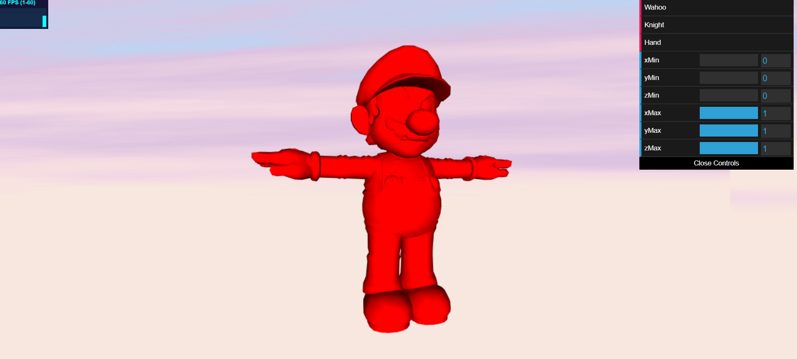

# Final Project: Bread

## Stephanie Goldberg - slgold
- Demo: https://slgold95.github.io/bread/
- You will need to scroll out when it is first loaded up because the camera begins close to the voxelized Wahoo.

## References
- Lecture slides on Voxelizing a Mesh: https://docs.google.com/presentation/d/e/2PACX-1vSXYK_Ic2S46Z4rDcJPFIJDvrVURgYq5mcIcbWRJpZQDj7p4rKiy9I31qdqohnyXBQzD7giTZF_7Yga/pub?start=false&loop=false&delayms=60000&slide=id.p
- Voxelizing obj files: http://drububu.com/miscellaneous/voxelizer/?out=txt

## Work So Far
- Gui buttons to load up wahoo, knight, and hand.
- Gui sliders (currently do nothing)
- File loading
- Create a Mesh from the file loaded in
- Instance rendering for cubes to create my voxelization of the obj file
- All obj files load fine, working on voxelizing each case.
- Working on wahoo case first, then once that works I will move on and do the others.

## Voxelization
- From the voxelization resource, http://drububu.com/miscellaneous/voxelizer/?out=txt , saved the voxelization data as a .txt file
-   
- parsed the data from this file
- Created an array of voxel data (all those x,y,z coords for positions)
- Instance rendered cubes (as Meshes) with the voxel data
-  
-  

## Going Forward
- Now that I have the voxelization complete, I will create different arrays of voxel data to compute the necessary "texture maps" from the "Procedural Bread Making" paper to remove voxels and shape the overall voxels.
- Gui sliders will be used to display only parts of the voxelized mesh
